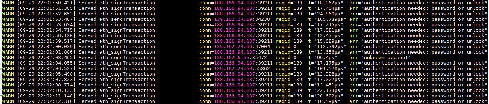

# Ethereum Node security

Here are some steps to improve Geth nodes security.

## Be careful about RPC
Maybe the simpler way is to actually not open the RPC while syncing(?) the chain.
There is no passphrase to protect the Geth RPC server. So all that is required to is your IP and the associated port.

## Block IPs
